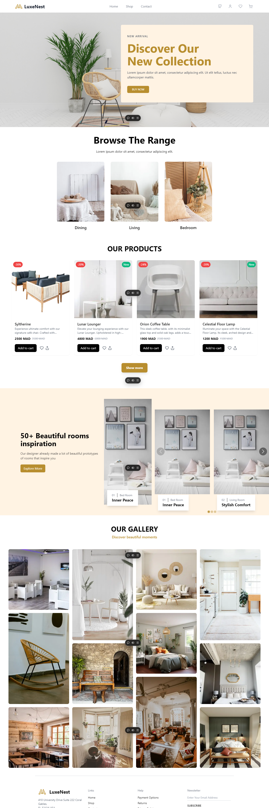

<div align="center">

# 🏰 LuxeNest - Luxury Real Estate Platform



A premium real estate platform built with Next.js, offering an exceptional experience for luxury property browsing.

</div>

## ✨ Features

- **Premium Property Listings**: Showcase luxury properties with high-quality images and detailed information
- **Advanced Search**: Filter properties by location, price, amenities, and more
- **Interactive Carousel**: Smooth property browsing with Swiper.js integration
- **Responsive Design**: Perfectly adapted for all devices using Tailwind CSS
- **Optimized Performance**: Fast loading times and SEO-friendly architecture
- **State Management**: Efficient state handling with Zustand

## 🛠️ Tech Stack

- **Frontend Framework**: [Next.js](https://nextjs.org/)
- **Styling**: [Tailwind CSS](https://tailwindcss.com/)
- **State Management**: [Zustand](https://github.com/pmndrs/zustand)
- **Carousel**: [Swiper.js](https://swiperjs.com/)
- **Font Optimization**: `next/font` with Google Fonts
- **Deployment**: Vercel

## 🚀 Getting Started

1. **Clone the repository**:

```bash
git clone https://github.com/yourusername/luxenest.git
cd luxenest
```

2. **Install dependencies**:

```bash
npm install
# or
yarn install
# or
pnpm install
# or
bun install
```

3. **Run the development server**:

```bash
npm run dev
# or
yarn dev
# or
pnpm dev
# or
bun dev
```

Open [http://localhost:3000](http://localhost:3000) with your browser to see the result.

## 📝 Development

You can start editing the page by modifying `app/page.js`. The page auto-updates as you edit the file.

This project uses [`next/font`](https://nextjs.org/docs/basic-features/font-optimization) to automatically optimize and load Inter, a custom Google Font.

## 📚 Learn More

To learn more about the technologies used in this project:

- [Next.js Documentation](https://nextjs.org/docs) - learn about Next.js features and API
- [Tailwind CSS Documentation](https://tailwindcss.com/docs) - learn about Tailwind CSS
- [Zustand Documentation](https://github.com/pmndrs/zustand) - learn about Zustand state management
- [Swiper Documentation](https://swiperjs.com/get-started) - learn about Swiper.js

## 🚀 Deployment

The easiest way to deploy your Next.js app is to use the [Vercel Platform](https://vercel.com/new?utm_medium=default-template&filter=next.js&utm_source=create-next-app&utm_campaign=create-next-app-readme) from the creators of Next.js.

Check out the [Next.js deployment documentation](https://nextjs.org/docs/deployment) for more details.

## 🤝 Contributing

Contributions are welcome! Please feel free to submit a Pull Request.

## 📄 License

This project is licensed under the MIT License - see the LICENSE file for details.
